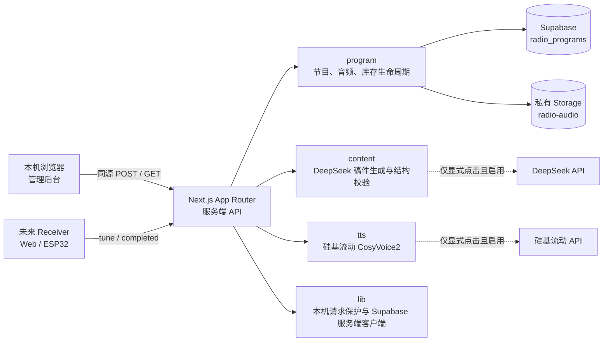
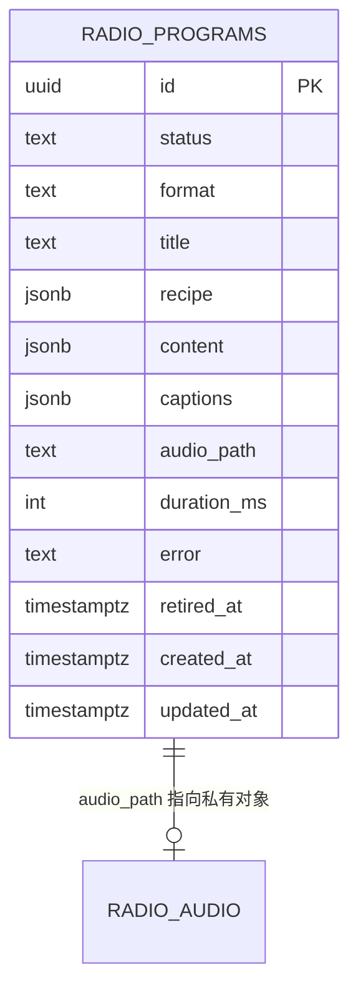
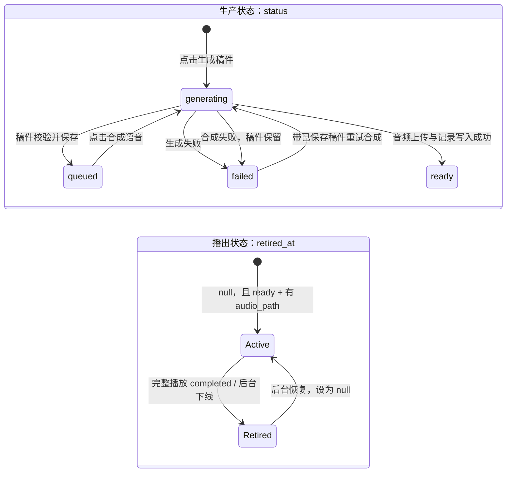
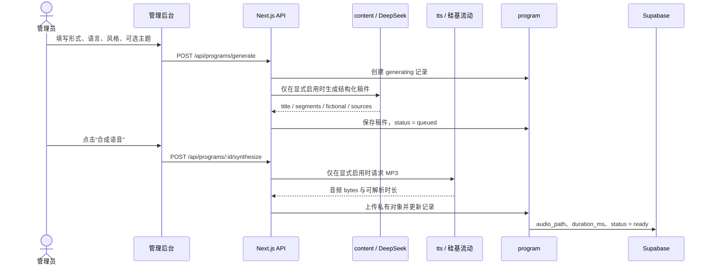
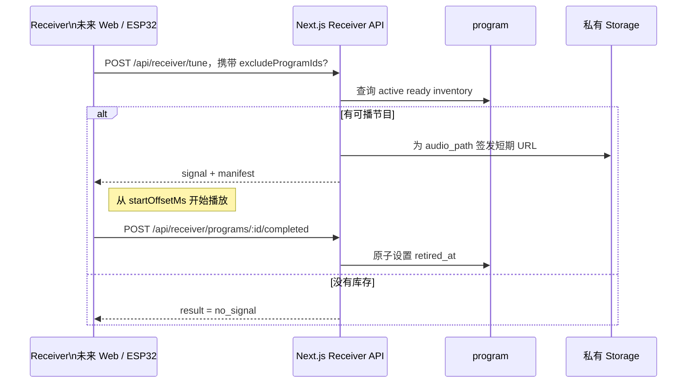
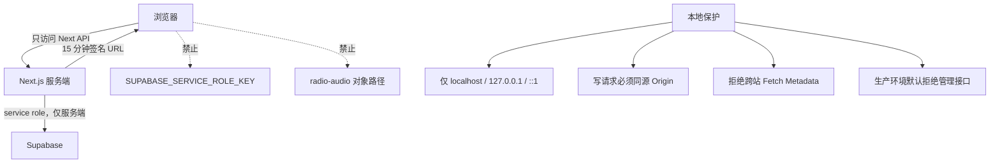

# 宇宙电台：架构与实现进展

> 本文对应当前 `radio/` 工作树。Task 003 检查点 A 已实现、尚待 review；它不包含 `/receiver` 页面或缓存。

## 先看结论

`radio/` 不是未来收音机本体，而是两部分能力的最小验证：

1. **内容管理后台**：人工发起稿件生成、语音合成、试听、下线和恢复。
2. **接收机协议**：未来 Web Receiver 与 ESP32 都只消费 `tune` / `completed` API，不需要知道 Supabase、DeepSeek 或 TTS 的内部细节。

目前真实音频和节目记录存于 Supabase；DeepSeek 与硅基流动的代码链路已经具备，但默认禁用，只有用户显式配置并点击操作才会产生付费调用。

## 系统全景



虚线表示可能产生费用的外部调用。它们没有在页面加载、刷新或 Receiver 调台时自动发生。

## 模块职责

| 模块 | 职责 | 不负责什么 |
| --- | --- | --- |
| `components/` | 管理表单、节目列表、详情、试听与下线/恢复操作 | 不持有服务端密钥，不直连 Supabase |
| `app/api/programs/` | 管理端的节目 CRUD、稿件生成、测试音频上传、TTS 合成 | 不向浏览器暴露 Storage 路径或 service role |
| `content/` | DeepSeek 配置、请求、结构化稿件 prompt 与运行时校验 | 不写数据库、不合成音频 |
| `tts/` | 硅基流动请求、音频响应和时长校验、并发保护 | 不生成稿件、不做混音或复杂 renderer |
| `program/` | `radio_programs` 与私有音频对象的读写、签名 URL、库存 retire/restore | 不调用 AI 供应商 |
| `receiver/` | Receiver manifest、调台参数解析与 `startOffsetMs` 纯函数 | 尚未包含浏览器播放器页面或缓存 |
| `lib/` | 仅本机开发请求保护、Supabase 服务端客户端 | 不实现生产鉴权 |

## 数据模型与两条生命周期

节目数据只使用一张 `public.radio_programs` 表，音频对象放在私有 `radio-audio` bucket。



`status` 与 `retired_at` 刻意分开：



只有同时满足下列条件的节目才是 Receiver 候选库存：

```text
status = 'ready'
AND retired_at IS NULL
AND audio_path IS NOT NULL
```

下线只写入 `retired_at`，不会删除数据库记录或 Storage 音频；删除节目仍是独立的后台删除操作。

## 内容到可试听音频的主链路



稿件的第一版结构是：

```ts
type BroadcastScript = {
  title: string;
  format: "news" | "chat";
  language: string;
  fictional: true;
  segments: Array<{ speaker: string; text: string }>;
  sources: string[];
};
```

没有真实检索来源时，节目必须明确是虚构广播；`news` 允许 1–12 段，`chat` 要求 2–12 段且至少两位不同说话者。

## Receiver 协议（Task 003 检查点 A）

Receiver 只调用以下接口，不读取节目表、不拼接 Storage 对象路径：



`POST /api/receiver/tune` 的成功响应：

```ts
{
  result: "signal",
  manifest: {
    programId: string,
    title: string,
    format: "news" | "chat" | "music",
    audioUrl: string, // 短期服务端签名 URL
    audioExpiresAt: string,
    durationMs: number,
    startOffsetMs: number,
    captions: unknown[],
    retireOnComplete: true
  }
}
```

`excludeProgramIds` 最多 20 项，用于避免连续调到刚听过的节目。`startOffsetMs` 是可测试纯函数：时长不超过 20 秒从 0 开始；其他节目在 4–15 秒内切入，同时保证至少剩余 15 秒可听内容。

`completed` 只应在播放器真正触发 `ended` 后调用。切台、暂停、页面关闭和加载失败都不应调用它。接口使用 `retired_at IS NULL` 的条件更新，因此重复或并发回调中只有一次会实际下线。

## 安全与资源边界



当前 API 仅为本机开发而设计。未来开放 ESP32 的 LAN 或公网访问前，必须单独设计设备鉴权与对应的 RLS/访问策略，不能复用或放宽现有本机保护。

## 实现进展

| 工作项 | 状态 | 已交付 | 明确未做 |
| --- | --- | --- | --- |
| Task 001：原型与最小数据资源 | 已完成 | Next.js + pnpm、管理后台、`radio_programs`、私有 bucket、上传/试听/删除 | ESP32、完整收音机体验 |
| Task 002 A：可靠性与本机保护 | 已完成 | 同源保护、私有对象清理补偿、签名 URL 刷新 | 生产鉴权 |
| Task 002 B：文本生成 | 代码已实现，默认不产生费用 | DeepSeek 配置、输入/输出校验、生成锁、稿件预览 | 自动生成、真实新闻检索 |
| Task 002 C：TTS | 代码已实现，默认不产生费用 | 硅基流动 CosyVoice2、MP3/时长校验、合成锁、私有上传 | 多音色混音、音乐、音效 |
| Task 003 A：库存与 Receiver API | 已实现，待 review | `retired_at` 迁移、active inventory、tune/completed、后台下线恢复 | `/receiver` 页面、缓存、ESP32 接入 |
| Task 003 B | 未开始 | — | 浏览器 Receiver 播放器与 ended 逻辑 |
| Task 003 C | 未开始 | — | 2 条内存预取缓存、快速连续调台处理 |

## 已验证与下一步

当前工作树已验证：

- 迁移 `20260910070120_add_radio_program_retired_at` 已应用到远端 Supabase。
- 临时、可清理节目验证了 inventory、`no_signal`、manifest、下线、恢复，以及 completed 并发幂等；测试数据已清理。
- `pnpm test:checkpoint-b`（25 项）、`pnpm lint`、`pnpm typecheck`、`pnpm build` 均通过。

下一步在 review 通过后才进入 Task 003 检查点 B：新增 `/receiver` 页面，消费现有 Receiver API，并只在音频真正结束时发送 `completed`。不应在该检查点之前实现缓存或开放设备访问。

## 代码导航

- [节目与资源服务](../program/service.ts)
- [节目类型](../program/types.ts)
- [文本生成入口](../content/script.ts)
- [TTS 入口](../tts/siliconflow.ts)
- [Receiver manifest 与偏移算法](../receiver/manifest.ts)
- [Receiver 调台接口](../app/api/receiver/tune/route.ts)
- [Receiver 完成回调](../app/api/receiver/programs/[id]/completed/route.ts)
- [本机保护与 Supabase 服务端客户端](../lib/supabase-server.ts)
